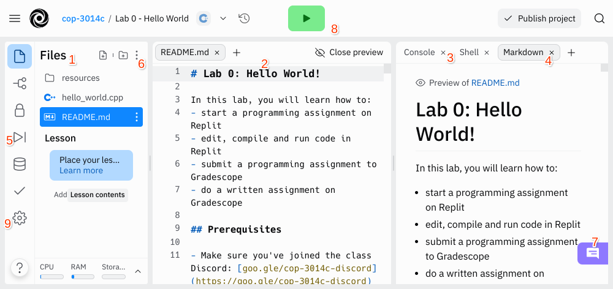

# Lab 0: Hello World!

In this lab, you will learn how to:
- start a programming assignment on Replit
- edit, compile and run code in Replit
- submit a programming assignment to Gradescope
- do a written assignment on Gradescope

## Prerequisites

- Make sure you've joined the class Discord: [goo.gle/cop-3014c-discord](https://goo.gle/cop-3014c-discord)
- Make sure you've joined the class Replit: [goo.gle/cop-3014c-replit](https://goo.gle/cop-3014c-replit)
- Make sure you've joined Gradescope

## Step 1: Start project on Replit

New programming assignments will show up on Replit under **Team Projects**. Click on **Start project** to grab your own working copy.


You may get a prompt asking you to enable notifications. This is entirely up to you. Replit allows for real-time collaboration - you can tag collaborators or instructors directly in your code and it will notify them if their notifications are enabled.


Once you close the prompt, your working copy should appear similar to the screenshot below.



1. File browser
    - This is a graphical representation of the file system on the (Replit) computer. You technically don't need it since you can manipulate files through the terminal, but it's nice for visualization and convenience.
2. Text editor
    - This is where we write code. You can highlight a piece of code to start a thread and bring it to the attention of a collaborator or instructor.
3. Terminal / command line / console
    - Click on **Console** to show the terminal tab. This is where you can interact with the (Replit) computer by typing in UNIX commands.
4. Markdown viewer
    - This is a rendering of `README.md`, a markdown file, which you can see in the file browser. You will find instructions for completing the assignment here.
5. Debugger
    - A debugger allows us to step through our program and inspect what's going on. We will make use of this later on.
6. File browser hamburger menu
    - You can click on it to **Download as zip**. This will allow you to submit your code to Gradescope.
7. Chat
    - Replit provides a real-time chat for collaborators. This is optional and we will most likely end up just using Discord.
8. Run
    - This is a convenience button that allows you to compile and run your code with one single click. We will **not** be using it in this course (it assumes we always have a `main.cpp` file which is not the case).
9. Settings
    - Here, you can turn on dark mode.

## Step 2: Compile and run the starter code

You will notice a `hello_world.cpp` file in the file browser. The `.cpp` extension tells us that it's a c++ source file. Compile it to turn it into an executable program that the computer can run.

One way to compile c++ source code is to use the `g++` command. It uses the g++ compiler to create an object code program called `a.out`.

In general, this command is:
```
$ g++ <filename>
```

For this exercise, the command is:
```
$ g++ hello_world.cpp
```

Type the above command into the terminal. If everything works correctly, there will be no terminal output and a `a.out` file will be created. This is your compiled program which you can run by typing:
```
$ ./a.out
```

Programs have a few ways of providing output to the user. One of them is by printing things directly in the terminal. You should see that the program printed a message.

Another way a program can provide information to the user is via the exit code. You can check the exit code of the last command with:
```
$ echo $?
```

The output of this command is `0`, which means that the program exited with a return code of 0.

Here's a screenshot of what this step might look like in Replit.


## Step 3: Read and modify the code

Click on `hello_world.cpp` to open up the code.

```
// hello_world.cpp
// Name(s):
// TODO: fill in your name above
```

Lines that start with `//` are called *comments*. They are strictly for the human reader and are ignored by the compiler.

Actionable instructions will be annotated with a `TODO`. Work from top to bottom and complete the tasks described in the `TODO` comments. Once you finish with a task, delete the corresponding `TODO` comment. When you are done, there should be no more `TODO` comments in the file.

Here's an example of completion for the above code snippet.

```
// hello_world.cpp
// Name(s): Daniel Campello
```

Next up, we have the following two lines.

```
#include <iostream>
using namespace std;
```

For now, treat this as boilerplate code that you should have in every program. Later on in the course, we'll discuss what these lines actually mean.

Keep going and we reach the code snippet below.

```
int main() {
  // TODO: replace "Hello, World!" by "Hello, {your first name}!"
  // eg. if your first name is Bob, replace it by "Hello, Bob!"
  cout << "Hello, World!" << endl;

  return 0;
}
```

Every C++ program needs to have what is called a **main function**. It starts with `int main() {`
and contains some lines of code before ending in `}`. Again, let's treat this as boilerplate code that you should have in every program - we'll learn what these lines actually mean later as well.

When a computer runs your program, it will start by doing the first thing inside the curly brackets of the main function, then proceed one statement after the other.

The first statement in this piece of code says `cout << "Hello, World!" << endl;`. **Every statement in C++ needs to end with a semicolon (;).** A statement that starts with `cout <<` will print the things that come after it to the terminal. If there are multiple `<<` present in the statement, it will print all of those things in order from left to right.

This statement will first print `Hello, World!`. `"Hello, World!"` is written in quotes in the program because it is a `string`. A `string` is one of the data types in C++ and represents characters or words. 
You have to put strings in quotes so that the computer knows that it is a string - otherwise it will get very confused and try to treat your words as code.

Then, the statement will print out what's called a newline character. This is an invisible character that starts a new line, just like hitting the enter key does. The special word `endl` (note the lack of quotes!) represents the newline character.

The second statement in this piece of code says `return 0;`. When the main function gets to a return statement, the program exits with a return value of whatever was specified (in this case, 0).
The return value of the main function has to be an `int`. `int` is another data type in C++ and it represents integer numbers (like 0, 1, -10, 12345). That's why `0` isn't in quotes here - if it was in quotes, it would be a `string`. Since `string` and `int` are two different types, the computer wouldn't be happy.

Here's an example of completion for the above code snippet.

```
int main() {
  cout << "Hello, Daniel Campello!" << endl;

  return 0;
}
```

## Step 4: Compile and run the updated code

Every time you make changes to your code, you need to recompile it so that an updated version of the program is created. Compile your code again to get a new `a.out` file.
```
$ g++ hello_world.cpp
```

If you made mistakes while coding, g++ will print some output and will not update `a.out`. If this happens, you'll need to read the error messages that g++ printed and try to resolve them before compiling again.

Once g++ finishes without printing anything, you can run the new compiled program.
```
$ ./a.out
```

Here's an example of completion for this step.


## Step 5: Submit code to Gradescope

Once you've completed the programming assignment, you can download everything as zip so that you can submit it to Gradescope.


Log into your account on [gradescope.com](https://www.gradescope.com).

Click on `Lab 0 - Programming`.


Upload the zip file you just downloaded.


Autograder will start running. If everything goes well, you should see something like this.


If you made mistakes, some tests may fail and you may get error messages. Try to resolve them before submitting again. You have unlimited attempts until the assignment deadline.

## Step 6: Do the written assignment on Gradescope

Every lab will come with a written section on top of the programming section. This is usually for testing your theoretical knowledge.

Click on `Lab 0 - Written`.


Answer the questions as best as you can.


If everything goes well, you should see something like this.


